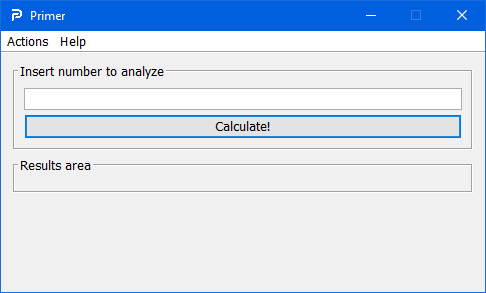
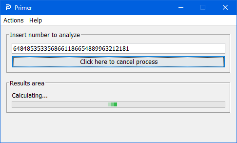
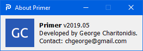

## Primer
An attempt to analyze any given integer (no matter its size) into prime factors.

## Motivation
My passion concerning mathematics and prime numbers (Riemann hypothesis and cryptography).

## Build status
Under heavy construction, adding fixes and features every day. As well as bugs lol.

## Code style
Standard style, using exclusively VS Code.
 
## Screenshots

## Language/framework/tools used
Core Java, MigLayout, Swing, SwingWorker

## License
MIT © George Charitonidis
